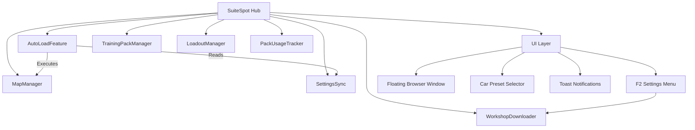

# SuiteSpot Architecture & Technical Reference

## Project Context
*   **Type:** BakkesMod Plugin (C++ Dynamic Link Library)
*   **Platform:** Windows x64 (Rocket League requirement)
*   **Language:** C++20
*   **Dependencies (via vcpkg):**
    *   **BakkesMod SDK:** Core game hooks, CVars, ImGui integration.
    *   **ImGui 1.75:** User interface (DirectX 11 backend). Custom widgets in `IMGUI/`.
    *   **nlohmann-json:** JSON parsing for pack database and usage stats.
    *   **sqlite3, spdlog, fmt:** Storage, structured logging, string formatting.
    *   **openssl, ixwebsocket:** HTTPS for workshop API, WebSocket support.

## Architecture

The project follows a **Hub-and-Spoke** pattern where `SuiteSpot.cpp` manages the plugin lifecycle and all inter-component communication. Components do not communicate directly.

## Technical Implementation Details

### 1. Data Structures (`MapList.h`)
The plugin manages three distinct types of content:
*   **Standard Maps (`MapEntry`):** Simple code/name pairs.
*   **Training Packs (`TrainingEntry`):** Rich metadata including:
    *   `code`: The 16-character share code.
    *   `difficulty`(least >> most): Unranked >> Bronze >> Silver >> Gold >> Platinum >> Diamond >> Champion >> Grand Champion >> Supersonic Legend.
    *   `tags`: Vector of descriptive tags (e.g., "Air Dribble", "Defense").
    *   `videoUrl`: Optional YouTube preview link (broken and needs fixed).
    *   `source`: Tracks origin ("prejump" for scraped, "custom" for user-added).
*   **Workshop Maps (`WorkshopEntry`):** Local file pointers to `.udk` files with metadata parsed from JSON or folder names.

### 2. Auto-Load Logic (`AutoLoadFeature.cpp`)
This is the core automation engine.
*   **Trigger:** `OnMatchEnded` event hook.
*   **Logic:**
    1.  Checks `SettingsSync` for the preferred mode (Freeplay, Training, Workshop).
    2.  Resolves the specific map/pack code.
    3.  **Delays:** Uses `gameWrapper->SetTimeout()` to schedule the load command (e.g., `load_freeplay`). This is critical because immediate loading can crash the game during the match-end sequence.
    4.  **Queuing:** If "Auto-Queue" is enabled, it triggers the queue command after a configured delay.

### 3. Training Pack Management (`TrainingPackManager`)
*   **Persistence:** Packs are stored in `%APPDATA%\bakkesmod\bakkesmod\data\SuiteSpot\TrainingSuite\training_packs.json`.
*   **Data Source:** `UpdateTrainingPackList` writes a temporary PowerShell script (`SuitePackGrabber_temp.ps1`) to the system temp directory, executes it via `cmd.exe`, and captures output to update the local cache.
*   **Filtering:** Implements robust searching by Name, Code, Tags, Difficulty, and Video availability.
*   **Usage Tracking:** `PackUsageTracker.cpp` serializes user history (`loadCount`, `lastLoadedTimestamp`) to `training_usage.json`, enabling "Favorites" sorting.

### 4. Workshop Integration (`WorkshopDownloader` & `MapManager`)
*   **Discovery (`MapManager`):** Scans configured directories recursively for `.udk` or `.upk` files.
*   **Downloading (`WorkshopDownloader`):**
    *   **API:** `https://bakkesplugins.com/api/rocket-league-maps` — returns all 287 maps in a single `GET ?search=&pageSize=500&page=1` call. Cached locally; search is client-side.
    *   **Detail fetch:** `GET /{id}` retrieves `files[0].edgeUrl` (CDN download link) and `bannerUrl` (preview image).
    *   **Thread safety:** Uses mutex + atomic `completedResults`/`expectedResults` to safely drain in-flight HTTP callbacks before DLL unload.
    *   **Extraction:** Uses `system("powershell.exe Expand-Archive ...")` to unzip downloaded maps.

### 5. Settings & Synchronization (`SettingsSync`)
*   **CVar Backing:** All settings are backed by BakkesMod's `CVarManager`.
*   **Callback Pattern:** Uses `.addOnValueChanged([this](...) { ... })` to immediately sync CVar changes to local member variables, ensuring extremely fast read access during the render loop.
*   **Naming:** All CVars are prefixed with `suitespot_` (e.g., `suitespot_enabled`, `suitespot_delay_queue`).

### 6. User Interface (`UI Layer`)
*   **Framework:** ImGui 1.75 (Immediate Mode GUI). Custom widgets in `IMGUI/`.
*   **Training Pack Browser:**
    *   **Virtual Scrolling:** Uses `ImGuiListClipper` to render only visible items from the 2300+ pack database.
    *   **Sorting:** Clickable column headers toggle between Ascending/Descending.
    *   **Drag & Drop:** Supports dragging packs from the browser to "Quick Pick" slots.
*   **Workshop Browser:**
    *   Browse-on-launch: auto-populates all maps when the tab opens (no search required).
    *   Single local search bar — all filtering is client-side after initial API load.
    *   Selection persists across list rebuilds via `selectedMapID` (string ID, not fragile index).

### 7. Critical Threading Rules
*   **Game thread:** Use `gameWrapper->Execute()` to defer any shared-state modification between frames. Use `gameWrapper->SetTimeout()` for delayed post-match execution (minimum 0.1s).
*   **Font loading:** Never call `GUIManager::LoadFont()` inside a render function or directly in `SetImGuiContext()` — atlas rebuild crashes the game. Always wrap in `Execute()` and guard with `GetFont()` first.
*   **Download threads:** `WorkshopDownloader` spins in the destructor until all async HTTP callbacks complete before returning — prevents use-after-free on DLL unload.