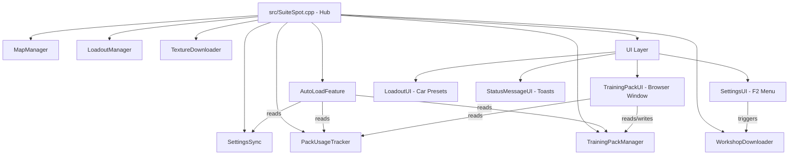

# SuiteSpot Architecture & Technical Reference

## Project Context

| Attribute | Value |
|-----------|-------|
| Type | BakkesMod Plugin (Windows x64 DLL) |
| Language | C++20 |
| UI Framework | ImGui 1.75 (DirectX 11 backend) |
| Plugin SDK | BakkesMod SDK (header-only, Windows x64) |
| JSON | nlohmann-json |
| HTTP | ixwebsocket + openssl |
| Logging | spdlog + fmt |

---

## Source Layout

```
SuiteSpot/
├── src/
│   ├── SuiteSpot.cpp/.h         Hub — plugin entry, lifecycle, event routing
│   ├── core/                    Business logic and data managers
│   │   ├── AutoLoadFeature      Post-match automation with delay scheduling
│   │   ├── SettingsSync         BakkasMod CVar management
│   │   ├── MapList.h            Data structures (MapEntry, TrainingEntry, WorkshopEntry)
│   │   ├── MapManager           Workshop map discovery and path resolution
│   │   ├── TrainingPackManager  2300+ pack database, search, filter, pagination
│   │   ├── WorkshopDownloader   RLMAPS API integration, async downloads
│   │   ├── LoadoutManager       Car preset switching (game-thread safe)
│   │   ├── PackUsageTracker     Load counts + timestamps, powers favorites ranking
│   │   ├── TextureDownloader    Auto-downloads 14 workshop editor textures
│   │   ├── DefaultPacks.h       Curated "Flicks Picks" training pack list
│   │   └── EmbeddedPackGrabber.h  Embedded pack scraper logic
│   ├── ui/                      ImGui UI components
│   │   ├── SettingsUI           F2 settings menu (Map Select, Loadout, Workshop tabs)
│   │   ├── TrainingPackUI       Floating pack browser (PluginWindow)
│   │   ├── LoadoutUI            Car preset selection panel
│   │   ├── StatusMessageUI      Toast notification system
│   │   ├── HelpersUI            Reusable ImGui widget helpers
│   │   └── ConstantsUI.h        Centralized UI styling constants
│   └── utils/
│       ├── logging.h            spdlog-based LOG() macros
│       └── ProcessUtils.h       Process and path utilities
├── IMGUI/                       Third-party ImGui (unchanged)
├── imgui/                       Custom ImGui widgets (range slider, searchable combo, timeline)
├── CompiledScripts/             PowerShell utilities
│   ├── SuitePackGrabber.ps1     Scrapes 2300+ training packs to JSON
│   └── update_version.ps1       Pre-build version bumper
├── DataToCopy/                  training_packs.json (2.6MB database)
├── Resources/                   Plugin images (logos, NoPreview.jpg, icons)
├── fonts/                       Font files (Ubuntu-Regular.ttf, Roboto-Medium.ttf, fa-solid-900.ttf)
├── tests/                       Catch2 unit tests (no live game required)
├── docs/                        Documentation
├── pch.cpp / pch.h              Precompiled header (stays at root — PCH special case)
├── Source.cpp                   DLL entry point (BAKKESMOD_PLUGIN macro)
├── version.h                    VERSION_MAJOR/MINOR/PATCH/BUILD defines
└── SuiteSpot.vcxproj            MSBuild project file
```

---

## Hub-and-Spoke Architecture

`src/SuiteSpot.cpp` is the Hub. All inter-component coordination passes through it. Components never talk to each other directly — this prevents circular dependencies and keeps threading predictable.



---

## Features

### 1. Post-Match Auto-Load (`src/core/AutoLoadFeature.cpp`)

Triggered by `EventMatchEnded`. Reads `SettingsSync` for the configured mode, then schedules a load command via `gameWrapper->SetTimeout()`:

- **Freeplay** — `load_freeplay`
- **Training Pack** — `load_training <code>` with fallback chain: QuickPicksSelected → currentTrainingCode → PackUsageTracker top picks → DefaultPacks::FLICKS_PICKS
- **Workshop Map** — `load_workshop <path>`

Minimum 0.1s delay always enforced to prevent crashes during the match-end state transition.

### 2. Auto-Queue

After auto-loading a training session, schedules `queue` command with a configurable delay (default disabled). Allows automatic re-queuing after training.

### 3. Training Pack Browser (`src/ui/TrainingPackUI.cpp`)

A `PluginWindow` (separate floating window managed by BakkasMod):

- **Left panel:** Virtual-scrolled list via `ImGuiListClipper` — renders only visible rows from 2300+ entries
- **Right panel:** Pack details, YouTube thumbnail (lazy-fetched on demand), load/favorite controls
- **Filters:** Full-text search, difficulty dropdown, tag filter, shot count range slider, video-only toggle
- **Sort:** Clickable column headers (Name, Creator, Difficulty, Shots) — toggle ascending/descending
- **Custom packs:** CRUD modal for user-defined packs stored in the local JSON database

### 4. Quick Picks

Two modes, configurable count:
- **Flicks Picks** — Curated high-quality pack list from `src/core/DefaultPacks.h`
- **Your Favorites** — Usage-ranked packs from `PackUsageTracker`, sorted by load count × recency

### 5. Workshop Downloader (`src/core/WorkshopDownloader.cpp`)

Searches `https://bakkesplugins.com/api/rocket-league-maps`. Thread safety via:
- `std::mutex` on result lists
- Atomic `searchGeneration` — callbacks check generation before touching shared state, preventing stale writes

Download flow: API search → select map → fetch release list → user selects release → download ZIP → PowerShell `Expand-Archive` → rename `.udk`→`.upk` → write JSON metadata.

### 6. Workshop Local Browser

Two-panel layout. Path configured via the WorkshopMapLoader BakkasMod plugin. Preview images downloaded and cached per map ID. Selection persists across list rebuilds via `selectedMapID` (string, not fragile index).

### 7. Hotkey System (`src/SuiteSpot.cpp`)

Dual-key combos only (trigger key + hold modifier). 5 configurable actions:
- Cycle map mode forward / backward
- Cycle map forward / backward
- Load now

Captured via `HandleKeyPress` hook + `heldKeys` set tracking. UE3 key name strings. CVars: `suitespot_hotkey_*`.

### 8. Loadout Manager (`src/core/LoadoutManager.cpp`)

Car preset switching during training sessions. All operations go through `gameWrapper->Execute()` for game-thread safety — canonical example for the Execute() pattern.

### 9. Pack Usage Tracker (`src/core/PackUsageTracker.cpp`)

Persists `{ loadCount, lastLoadedTimestamp }` per pack code to `pack_usage_stats.json`. Used to rank "Your Favorites" in the Quick Picks mode.

### 10. Pack Healer

Hooks `GameEvent_TrainingEditor_TA.OnInit`. After 1.5s (allows full initialization), reads `TrainingEditorWrapper.GetTotalRounds()` and updates the stored shot count in the pack DB. Also exposed as `ss_heal_current_pack` console notifier.

### 11. Training Game Speed Fix

Hooks `SetTrainingGameSpeed` UE4 function. After loading a training pack, re-applies `suitespot_training_game_speed_fix` CVar to `sv_soccar_gamespeed`. Prevents official training from resetting custom game speed.

### 12. Texture Downloader (`src/core/TextureDownloader.cpp`)

On plugin load, checks `CookedPCConsole` directory for 14 required `.upk` engine texture files needed by workshop maps. Downloads any missing files in a background thread. Prevents blank/corrupted rendering in custom workshop maps.

### 13. Status Message System (`src/ui/StatusMessageUI.h`)

Reusable `UI::StatusMessage` class:
- **DisplayMode:** Timer (instant hide), TimerWithFade (smooth alpha fade), ManualDismiss (requires user click)
- **Type:** Success (green), Error (red), Warning (yellow), Info (blue)

---

## Build System

Two completely independent pipelines. Never mix SDK/vcpkg paths between them.

| Aspect | Local | CI (GitHub Actions) |
|--------|-------|---------------------|
| SDK location | `%AppData%\bakkesmod\bakkesmodsdk` via registry | Cloned to `bakkesmodsdk/` |
| vcpkg | `%VCPKG_ROOT%` (local install) | `C:\vcpkg` (pre-installed on runner) |
| Post-build | Hot-reloads into live BakkasMod | DLL uploaded as artifact |
| Intermediates | `build\.intermediates\` | Discarded after run |

**Local build command:**
```powershell
& 'C:\Program Files\Microsoft Visual Studio\18\Community\MSBuild\Current\Bin\amd64\MSBuild.exe' SuiteSpot.sln /p:Configuration=Release /p:Platform=x64 /v:minimal
```

**Gitignored paths** (never commit): `bakkesmodsdk/`, `vcpkg_installed/`, `build/`, `plugins/*.dll`

**Pre-build:** `CompiledScripts/update_version.ps1` increments `VERSION_BUILD` in `version.h`.

**Post-build:** Copies DLL + resources to `%AppData%\bakkesmod\bakkesmod\`, patches with `bakkesmod-patch.exe`, hot-reloads if game is running.

---

## Data Locations

```
%APPDATA%\bakkesmod\bakkesmod\
├── plugins\SuiteSpot.dll
├── data\
│   ├── SuiteSpot\
│   │   ├── TrainingSuite\
│   │   │   ├── training_packs.json    (2300+ packs, 2.6MB)
│   │   │   └── pack_usage_stats.json  (per-pack load counts)
│   │   ├── Workshop\
│   │   │   └── NoPreview.jpg          (fallback image)
│   │   └── Resources\                 (logos, icons)
│   └── fonts\                         (Ubuntu-Regular.ttf, Roboto-Medium.ttf, fa-solid-900.ttf)
└── cfg\config.cfg                     (all suitespot_* CVars persisted here)
```

---

## Critical Patterns

### Game Thread Safety (crashes if violated)

Use `gameWrapper->Execute()` for same-frame game-thread operations. Use `gameWrapper->SetTimeout()` for delayed execution.

```cpp
// Canonical pattern — see src/core/LoadoutManager.cpp
gameWrapper->Execute([this](GameWrapper* gw) {
    auto gui = gw->GetGUIManager();
    // safe to read/write shared state here
});
```

### Font Loading (atlas rebuild = game crash)

**NEVER** call `LoadFont()` inside a render function or directly in `SetImGuiContext()`.

```cpp
// Safe pattern — used in src/SuiteSpot.cpp SetImGuiContext
clockFont = gui.GetFont("suitespot_clock_48");   // 1. Try GetFont first (hot-reload safe)
if (!clockFont) {
    gameWrapper->Execute([this](GameWrapper* gw) {
        if (clockFont) return;                   // 2. Guard against duplicate Execute() calls
        auto gui = gw->GetGUIManager();
        auto [res, font] = gui.LoadFont("suitespot_clock_48", "Ubuntu-Regular.ttf", 48);
        if (res == 2 && font) clockFont = font;  // 3. res==2 means loaded; 0=failed, 1=queued
    });
}
```

### Thread Safety (WorkshopDownloader)

`WorkshopDownloader` runs HTTP callbacks on background threads. Always check `searchGeneration` inside the callback before writing to shared state:

```cpp
int myGen = searchGeneration.load();
httpClient.get(url, [this, myGen](Response r) {
    if (searchGeneration.load() != myGen) return; // stale — discard
    std::lock_guard lock(resultsMutex);
    // safe to write results
});
```

### ImGui Layout Rules

- **Overlay text:** Use `ImDrawList::AddText(font, size, pos, color, text)` — bypasses layout cursor
- **DO NOT** use `SetCursorPos` backward — breaks all subsequent item layout
- **Crisp text:** Load fonts at target pixel size via `LoadFont`; never scale after load
- **Bounding box:** Use `GetItemRectMin()` / `GetItemRectSize()` after `EndGroup()` for overlay positioning

---

## CVar Reference

All CVars use `suitespot_` prefix and persist to `config.cfg`.

| CVar | Type | Description |
|------|------|-------------|
| `suitespot_enabled` | bool | Master enable/disable auto-load |
| `suitespot_map_type` | int | Load mode: 0=Freeplay, 1=Training, 2=Workshop |
| `suitespot_delay_queue` | float | Seconds to wait before loading after match end |
| `suitespot_training_code` | string | Default training pack code |
| `suitespot_training_game_speed_fix` | bool | Re-apply game speed after training pack loads |
| `suitespot_hotkey_*` | string | UE3 key name for each hotkey action |
| `suitespot_quick_picks_mode` | int | 0=Flicks Picks, 1=Your Favorites |
| `suitespot_quick_picks_count` | int | Number of quick picks to show |
